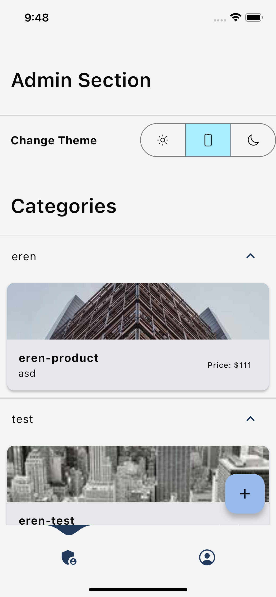
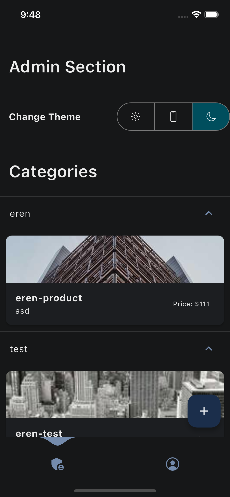
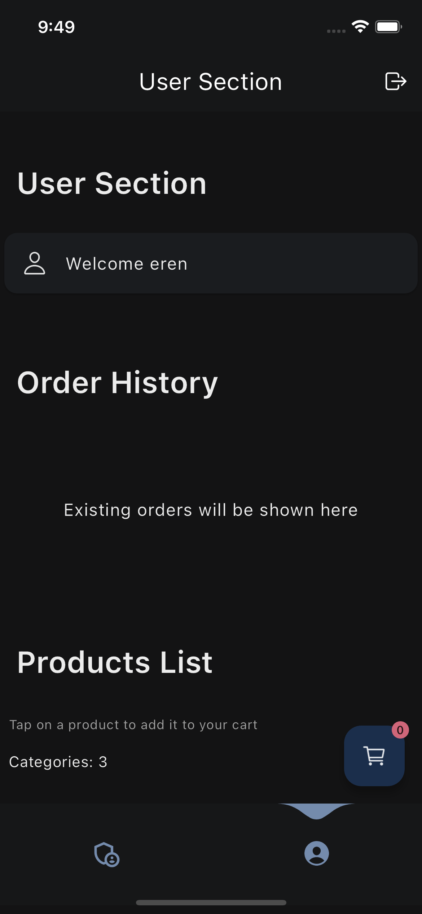
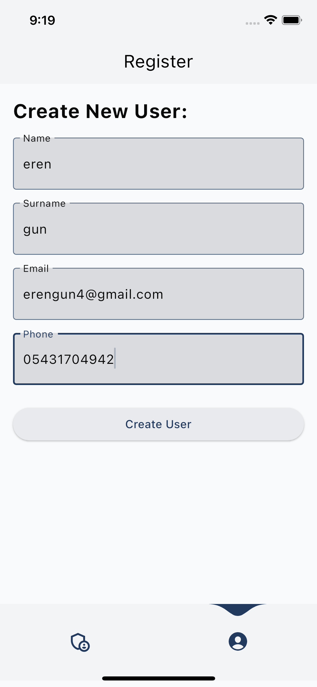
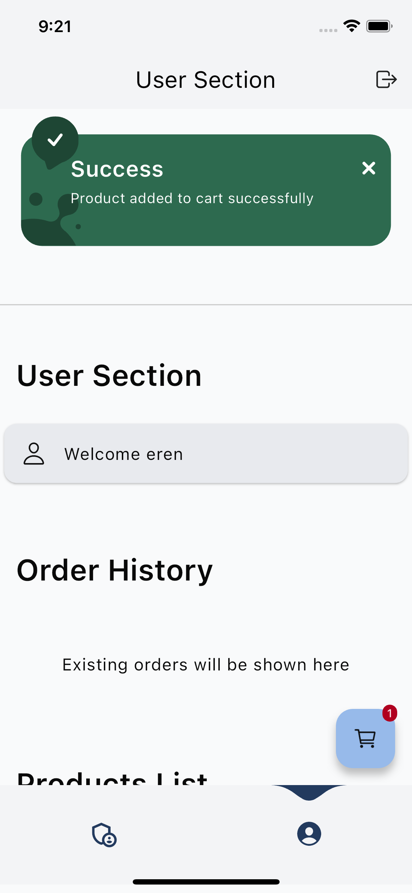
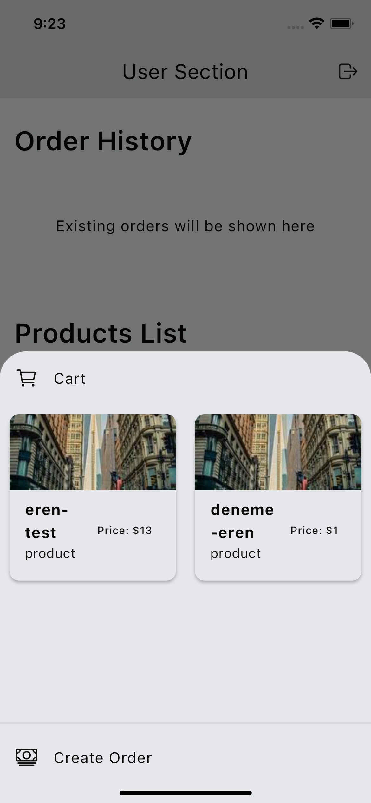
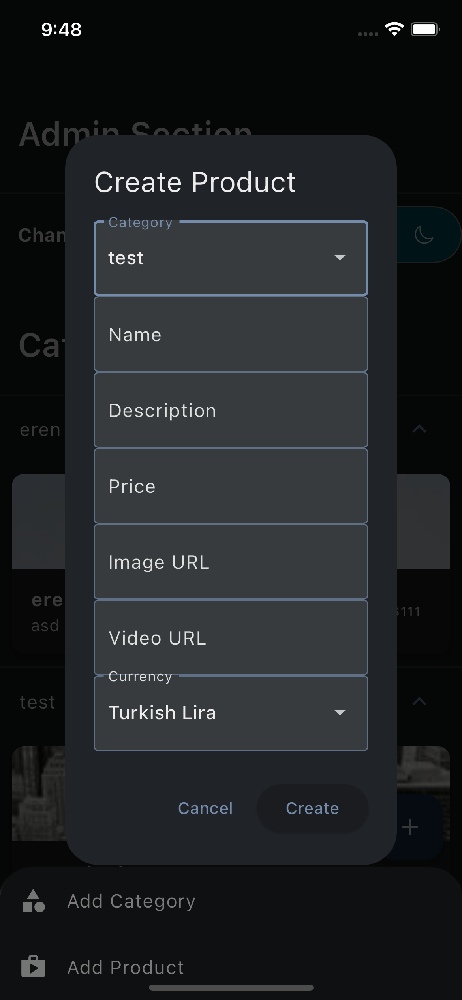

# JoinAct Case Study


## Case Study project for Ofis.work by Eren GÜN

The project includes two core APIs: one for admins and another for users. It also features two main screens, designed separately for admin and user use, along with both light and dark themes.

The project written upon the Template written by me. All credits goes to me.

## Features

- Using Riverpod 2.0 for state management.
- Using Riverpod and Freezed annotations for immutable state.
- Using Go Router for routing with fade and slide transitions.
- Using Flutter Lints for stricter linting rules.
- Using Hive for platform independent storage that also works for web.
- Project structure, const constructors, extracted widgets and many more...

## Getting Started
Get packages
```bash
flutter pub get
```

Run the app
```bash
flutter run
```

## Posible Errors
If you dont have generated files, you can generate them with this command
```bash
flutter pub run build_runner build
```

and of cousres if you have any error, you can clean the project with this command
```bash
flutter clean 
```
best problem solver :)


## Pub packages

This repository makes use of the following pub packages:

| Package                                                             | Version | Usage                              |
|---------------------------------------------------------------------|---------|------------------------------------|
| [Flutter Riverpod](https://pub.dev/packages/flutter_riverpod)       | ^2.3.6  | State management*                  |
| [Riverpod Annotation](https://pub.dev/packages/riverpod)            | ^1.0.3  | State management*                  |
| [Freezed Annotation](https://pub.dev/packages/freezed_annotation)                         | ^0.14.2 | Immutable state*                   |
| [Go Router](https://pub.dev/packages/go_router)                     | ^2.1.0  | Routing                            |
| [Get It](https://pub.dev/packages/get_it)                           | ^7.2.0  | Dependency injection*              |
| [Flutter Lints](https://pub.dev/packages/flutter_lints)             | ^2.0.1  | Stricter linting rules             |
| [Path Provider](https://pub.dev/packages/path_provider)             | ^2.0.11 | Get the save path for Hive         |
| [Flutter Displaymode](https://pub.dev/packages/flutter_displaymode) | ^0.5.0  | Support high refresh rate displays |
| [Easy Localization](https://pub.dev/packages/easy_localization)     | ^3.0.1  | Makes localization easy            |
| [Hive](https://pub.dev/packages/hive)                               | ^2.2.3  | Platform independent storage.      |
| [Url Launcher](https://pub.dev/packages/url_launcher)               | ^6.1.7  | Open urls in Browser               |
| [Ionicons](https://pub.dev/packages/ionicons)                       | ^0.2.2  | Modern icon library                |

## Screenshots

#### Light Theme

| Admin Light                                                                     | UserScreen Light                                                                     |
|--------------------------------------------------------------------------------|--------------------------------------------------------------------------------|
|  |  |

#### Dark Theme

| Admin Dark                                                                   | UserScreen Dark                                                                   |
|-----------------------------------------------------------------------------|-----------------------------------------------------------------------------|
|  |  |


## Extra Screenshots
| Create new User                                                                   | Success  Dialog                                                                   |
|-----------------------------------------------------------------------------|-----------------------------------------------------------------------------|
|  |  |

| Shopping List                                                                   | Create Product                                                                   |
|-----------------------------------------------------------------------------|-----------------------------------------------------------------------------|
|  |  |

### State management

The project uses [Riverpod](https://pub.dev/packages/flutter_riverpod) for state management. And instead of using old fashioned Provider.of(context) it uses [Riverpod_annotation](https://pub.dev/packages/riverpod) and [Freezed_annotation](https://pub.dev/packages/freezed_annotation) for immutable state. 

A new [riverpod_generator](https://pub.dev/packages/riverpod_annotation) package has been published as part of the Riverpod 2.0 release. This introduces a new @riverpod annotation API that you can use to automatically generate providers for classes and methods in your code (using code generation). To learn about it, read: [How to Auto-Generate your Providers with Flutter Riverpod Generator](https://codewithandrea.com/articles/flutter-riverpod-generator/).

### How can we manage state with Riverpod annotations and Freezed annotations?

It is very simple. First, create a freezed ui model class. For example:

```dart
import 'package:freezed_annotation/freezed_annotation.dart';

part 'counter_state.freezed.dart';
part 'counter_state.g.dart';

@freezed
abstract class CounterUiModel with _$CounterUiModel {
  const factory CounterUiModel({
    @Default(0) int count,
  }) = _CounterUiModel;

  factory CounterUiModel.fromJson(Map<String, dynamic> json) =>
      _$CounterUiModelFromJson(json);
}
```

The freezed_annotation package will generate the toJson() and fromJson() methods for you. You can also use the @Default annotation to set the default value. In this case it will be 0.


Then, create a logic for the state. For example:

```dart
import 'package:riverpod_annotation/riverpod_annotation.dart';

import 'counter_ui_model.dart';

part 'counter_logic.g.dart';

@riverpod
class CounterLogic extends _$CounterLogic {
  @override
  CounterUiModel build() {
    /// build() is called when the provider is first initialized. This is where you can initialize your state.
    return CounterUiModel(count: 0);
    /// Note; the Default(0) in the CounterUiModel class will be used if you don't initialize the count here. So you can also just return CounterUiModel() here.
  }

  void increment() {
    /// This is where you can update your state.
    state = state.copyWith(count: state.count + 1); 
  }
}
```

Thats it! Now you can run build_runner to generate the Providers for you instead of writing them yourself. For example:

```bash
dart run build_runner build
```

or if you want to watch for changes:

```bash
dart run build_runner watch
```

Now you can use the provider in your widgets. For example:

```dart
import 'package:flutter/material.dart';
import 'package:flutter_riverpod/flutter_riverpod.dart';
import 'package:riverpod_template/logic/counter_logic.dart';
import 'package:riverpod_template/models/counter_state.dart';

/// This is a ConsumerWidget. It will automatically rebuild when the state changes.
class CounterWidget extends ConsumerWidget {
  const CounterWidget({Key? key}) : super(key: key);

  @override
  Widget build(BuildContext context, WidgetRef ref) {
    /// This is where you can read the state.
    final counterState = ref.watch(counterLogicProvider);
    return Text(counterState.count.toString());
  }
}
```

Riverpod will automatically rebuild the widget when the state changes. So you don't have to use setState() anymore.

Please note that the state is not persistent. If you want to make the state persistent you can use Hive or another storage solution. For example:

### How can we make the state persistent?

Let's show how the template handles the theme state. First, create a freezed ui model class. For example:

```dart
import 'package:flutter/material.dart';
import 'package:freezed_annotation/freezed_annotation.dart';

part 'theme_ui_model.freezed.dart';
part 'theme_ui_model.g.dart';

@freezed
class ThemeUiModel with _$ThemeUiModel {
  const factory ThemeUiModel({
    /// We use the @Default annotation to set the default value. In this case it will be the device theme.
    @Default(ThemeMode.system) ThemeMode themeMode,
  }) = _ThemeUiModel;

  factory ThemeUiModel.fromJson(Map<String, dynamic> json) =>
      _$ThemeUiModelFromJson(json);
}
```

Then, lets look at the logic class:

```dart
// ignore_for_file: cast_nullable_to_non_nullable

import 'package:flutter/material.dart';
import 'package:hive/hive.dart';
import 'package:riverpod_annotation/riverpod_annotation.dart';

import 'theme_ui_model.dart';

part 'theme_logic.g.dart';

@riverpod
class ThemeLogic extends _$ThemeLogic {
  @override
  ThemeUiModel build() {
    /// in the build() method we read the themeMode from the Hive box. If it is not set we use the device theme and save it to the Hive box.
    ThemeMode themeMode = ThemeMode.system;
    final Box<String> prefsBox = Hive.box('prefs');
    final String mode = prefsBox.get('themeMode',
        defaultValue: ThemeMode.system.toString()) as String;
    switch (mode) {
      case 'ThemeMode.dark':
        themeMode = ThemeMode.dark;
        break;
      case 'ThemeMode.light':
        themeMode = ThemeMode.light;
        break;
      case 'ThemeMode.system':
        themeMode = ThemeMode.system;
        break;
    }
    /// We return the state with theme preference or device theme.
    return ThemeUiModel(themeMode: themeMode);
  }

  void setThemeMode(ThemeMode mode) {
    /// We save the themeMode to the Hive box.
    Hive.box<String>('prefs').put('themeMode', mode.toString());
    /// We update the state. This will automatically rebuild the widgets that use this provider. Too Easy!
    state = state.copyWith(themeMode: mode);
  }

  /// This method is used to toggle the theme.
  void toggleTheme() {
    if (state.themeMode == ThemeMode.dark) {
      setThemeMode(ThemeMode.light);
    } else {
      setThemeMode(ThemeMode.dark);
    }
  }
}

```

We let the riverpod_generator create the provider for us. All we have to do is call the provider in our widgets.

Learn more about Riverpod 2.0 and the riverpod_generator package here: [How to Auto-Generate your Providers with Flutter Riverpod Generator](https://codewithandrea.com/articles/flutter-riverpod-generator/).


### Dependency injection

The project uses [Get It](https://pub.dev/packages/get_it) for dependency injection. Your dependecies will automatically be registered with @injectable. All you have to do is call the provider.


### Theme

You can customize your brand colors in the [lib/config/theme.dart](./lib/my_app.dart) file.
The project uses colors from [FlexColorScheme](https://rydmike.com/flexcolorscheme/themesplayground-v7-2/). As
Feel free to replace those values with your own. In order to get a smooth transition for the text
colors it is necessary to override each text type in the TextTheme.

### Localization

The project uses [Easy Localization](https://pub.dev/packages/easy_localization) for localization. You can add your own languages by adding a new folder to [assets/translations](./assets/translations). The folder name should be the language code. For example: "en" for English or "de" for German. Inside the folder you can add a [language.json](./assets/translations/en.json) file. The file should contain a json object with the translations. The key should be the english translation and the value should be the translation for the language code. For example:

```json
{
  "Hello": "Hallo"
}
```

### Routing

The project uses [Go Router](https://pub.dev/packages/go_router) for routing. You can add your own routes in [lib/config/routes.dart](./lib/config/router/app_router.dart). The routes are defined in a Map with the route name as the key and the route builder as the value. The route builder is a function that returns a Widget. You can also pass parameters to the route builder function. The route builder function is called when the route is pushed to the navigator. For example:

First, define the route in the SGORouter:

```dart
{
  enum SGRoute {
  home,
  firstScreen,
  secondScreen,
  login,
  // Add your routes here
  }
}
```

Then, push the route to the navigator:

```dart
{
    GoRoute(
        path: SGRoute.{your_route_name}.name,
        builder: (BuildContext context, GoRouterState state) =>
            const SecondScreen(),
      ).fade(),
}
```

.fade() is optional and adds a fade transition, you can also use .slide()

The Call
  
```dart
  context.go(SGRoute.{your_route_name}.route);
```

